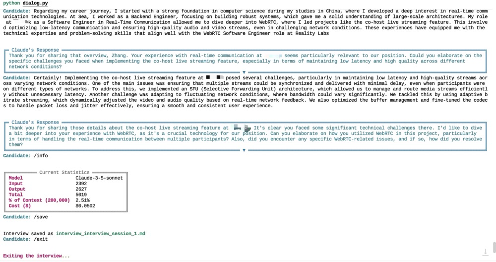

# Robert: Interview Agent

This project implements an AI-powered Software Interview Agent using the Anthropic Claude API and LangChain framework. The agent conducts realistic job interviews for software engineering positions, adapting its questions based on the candidate's resume and job description.


## 🚀 Features

- 🎭 Realistic interview simulation
- 📊 Adaptive questioning based on resume and job description
- 💬 Natural language processing for candidate responses
- 📝 Detailed feedback and evaluation

## Prerequisites

- Python 3.7+
- Anthropic API key

## 🛠️ Installation

1. Clone the repository:
   ```
   git clone https://github.com/NuckyInSg/interview-agent.git
   cd interview-agent
   ```

2. Install the required dependencies:
   ```
   pip install -r requirements.txt
   ```

## Usage

To use the InterviewDialog class for conducting a software engineering interview:

1. Ensure you have set up the necessary environment variables:
   - `ANTHROPIC_API_KEY`: Your Anthropic API key
   - `ANTHROPIC_API_URL`: The Anthropic API URL (if different from the default)

2. Prepare your resume and job description files:
   - Place your resume in PDF format at `./docs/local/resume.pdf`
   - Place the job description in text format at `./docs/local/job_description.txt`

3. Run the interview dialog:

```python
python main.py
```

4. Interact with the interviewer by responding to questions when prompted.

5. Use the following commands during the interview:
   - `/info`: Display current interview statistics
   - `/save`: Save the interview transcript and statistics
   - `/exit`: End the interview session

The interview dialog provides a rich, interactive experience with color-coded messages and formatted output for easy readability.

## License

This project is licensed under the MIT License - see the [LICENSE](LICENSE) file for details.